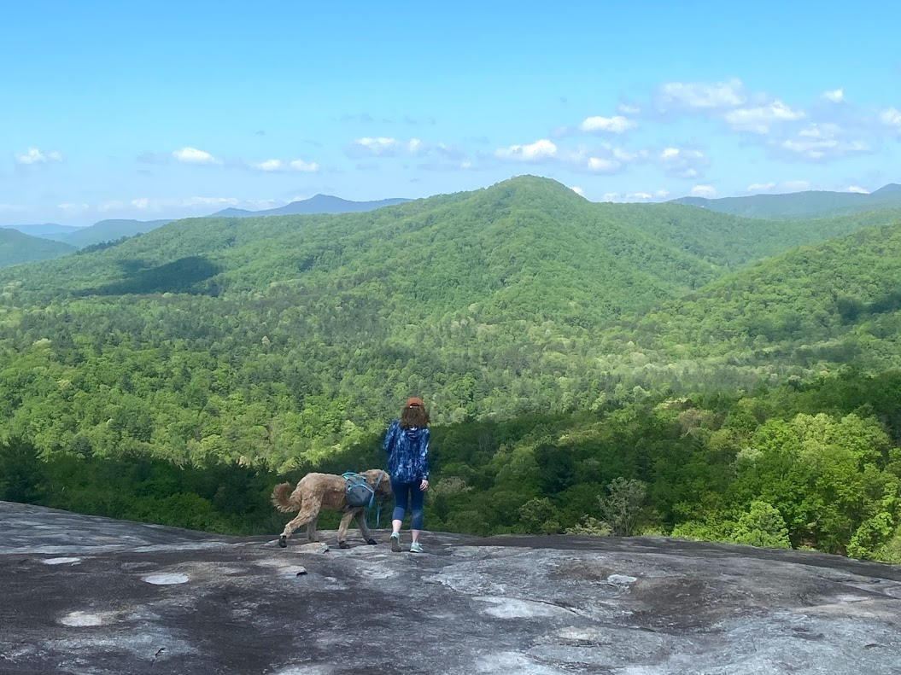

# Webkinz
  
  ## Description
  little dogs
  ## Table of Contents
  [Installation](#installation)

  [Usage](#usage)

  
[license](#license)

  [Contributing](#contributing)

  [Test](#test)

  [Questions](#questions)

 
  
  ## Installation
  eating
  ## Usage
  
  ## License 
    This project is licensed with GPL.
  ## Contributing
  mom
  ## Test
  nmp test
  ## Questions
  Any questions? Contact dauphineburns@gmail.com. Access more of my work at [burnsgirl](https://github.com/burnsgirl/).
